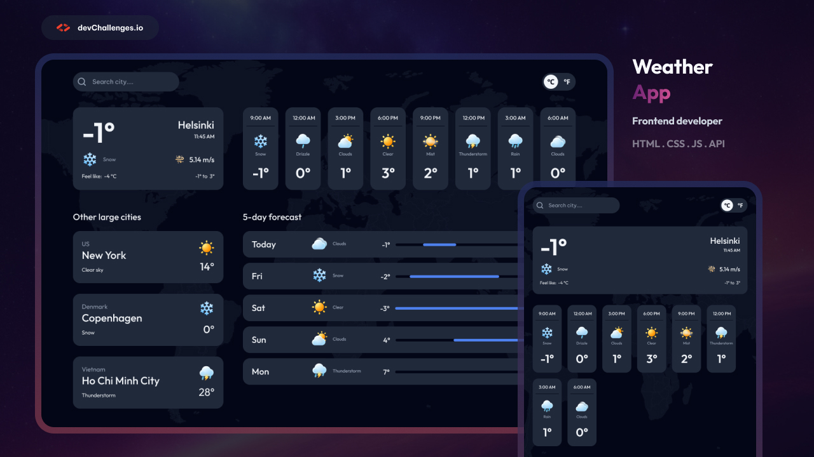

<h1 align="center">Weather App | devChallenges</h1>

   Solution for a challenge <a href="https://devchallenges.io/challenge/weather-app" target="_blank">Weather App</a> from <a href="http://devchallenges.io" target="_blank">devChallenges.io</a>.

  <h3>
    <a href="https://sercansimsek.github.io/weather-app/">
      Demo
    </a>
     | 
    <a href="https://github.com/sercansimsek/weather-app">
      Solution
    </a>
     | 
    <a href="https://devchallenges.io/challenge/weather-app">
      Challenge
    </a>
  </h3>

## Table of Contents

- [Overview](#overview)
- [What I learned](#what-i-learned)
- [Useful resources](#useful-resources)
- [Built with](#built-with)
- [Features](#features)
- [Contact](#contact)

## Overview

<!--
Introduce your projects by taking a screenshot or a gif. Try to tell visitors a story about your project by answering:

- What have you learned/improved?
- Your wisdom? :)
-->

### What I learned

<!-- Use this section to recap over some of your major learnings while working through this project. Writing these out and providing code samples of areas you want to highlight is a great way to reinforce your own knowledge. -->

### Useful resources

<!--
- [Example resource 1](https://www.example.com) - This helped me for XYZ reason. I really liked this pattern and will use it going forward.
- [Example resource 2](https://www.example.com) - This is an amazing article which helped me finally understand XYZ. I'd recommend it to anyone still learning this concept.
-->

### Built with

- Semantic HTML5 markup
- CSS custom properties
- Flexbox
- CSS Grid
- [React](https://reactjs.org/)

- [Tailwind](https://tailwindcss.com/)

## Features

This application/site was created as a submission to a [DevChallenges](https://devchallenges.io/challenges-dashboard) challenge.

## Author

- GitHub [@sercansimsek](https://{github.com/sercansimsek})
